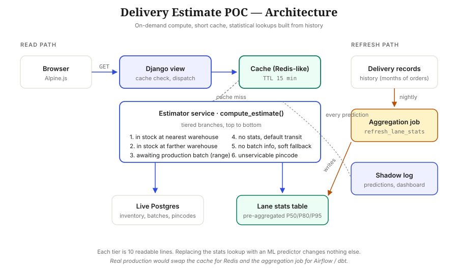

# Delivery Estimate · POC

> **The problem:** a D2C furniture brand shows every customer the same fixed "10 to 14 days" delivery promise — losing fast customers to competitors and angering slow ones with broken promises.
>
> **This POC:** a working Django + Alpine.js service that returns a personalized delivery date for every `(product, pincode)` request based on live inventory, scheduled production batches, and historical delivery performance. Includes shadow-logging and an accuracy dashboard.



---

## 30-second tour

```bash
./setup.sh                          # creates venv, installs, migrates, seeds
source .venv/bin/activate
python manage.py runserver
```

Then open <http://127.0.0.1:8000/>.

| Page | What it shows |
|---|---|
| **`/`** — Estimator | The customer-facing flow: pick a product, enter a pincode, get a delivery date with a reason and confidence level. Live inventory controls let you flip stock to zero and watch the system shift tiers in real time. |
| **`/dashboard/`** — Accuracy | Shadow log of every prediction. On-time rate overall and broken down by tier. With 60 auto-seeded resolved predictions, the dashboard tells a story on first load — no clicking required. |
| **`/admin/`** — Django admin | Inspect every table. Useful for verifying that seeding, stat refresh, and prediction logging all work end-to-end. |

---

## Demo script

Five interactions, two minutes total. Walk through these in this order:

1. **In-stock, confident date.** Pick `SOFA-001`, enter `110001` → arrives Friday with **high** confidence, reason *"In stock at our Delhi warehouse."*
2. **Out-of-stock, date range.** Pick `BED-002`, enter `110001` → returns a date *range* with **low** confidence, reason mentions the flaky supplier's typical slip. Compare with `SOFA-002` (same pincode, different supplier with better history) — the range is tighter.
3. **The "wow" toggle.** Go back to `SOFA-001` + `110001`. Click **Set to 0** for the Delhi warehouse stock row. Estimate instantly flips from `in_stock_nearest` → `in_stock_farther`, picking the Mumbai warehouse with a slightly later date.
4. **Pincode resolution.** Try `110099` (new pincode, same Delhi district) → confident date with note "*new pincode in this district*." Then `120001` (only the region matches) → date with **low** confidence and clear approximation note. Then `880001` (uncovered) → a distinct **Not yet serviceable** card, not a fake date.
5. **Open `/dashboard/`.** 60 pre-seeded predictions resolved, ~65% on-time overall. The `in_stock_nearest` tier sits near 83% — close to the configured P80 promise, which is exactly what the percentile choice means by construction.

---

## How it works in one paragraph

A single Django app `core` exposes `GET /api/estimate?sku=…&pincode=…`. The view resolves the pincode (exact → district → state → region prefix match → unserviceable), looks up live inventory, and dispatches to one of seven clear tiers in `core/services/estimator.py::compute_estimate()`. Transit times come from a pre-aggregated `LanePerformance` table populated by `python manage.py refresh_lane_stats` from historical `DeliveryRecord`s using the 80th-percentile transit per `(warehouse, cluster)` lane. Supplier slip statistics work the same way. Results are cached in Django's cache framework with a 15-minute TTL keyed by `(sku, cluster, match_quality, percentile)`. Inventory mutations invalidate affected entries. Every prediction is shadow-logged for the dashboard.

The architecture is **on-demand compute with a short cache, backed by statistical lookups refreshed nightly**. It's a deliberate starting point: precomputation, event-driven invalidation, and learned models are natural next steps when traffic and data volume justify them.

---

## The tier logic (the file to read first)

`core/services/estimator.py` — one function, top-to-bottom readable in two minutes:

```python
def compute_estimate(product, pincode):
    cluster, match_quality = resolve_cluster(pincode)
    if cluster is None:
        return _not_serviceable(today, pincode)

    stocked = Inventory.objects.filter(product=product, quantity__gt=0)
    if stocked:
        return _estimate_in_stock(today, handling, stocked, cluster, match_quality)
    return _estimate_out_of_stock(today, handling, product, cluster, match_quality)
```

Tiers in priority order:

| Tier | When it fires | Output | Confidence |
|---|---|---|---|
| `in_stock_nearest` | Stock at nearest warehouse, healthy lane | single date | high |
| `in_stock_farther` | Stock at a farther warehouse only | single date | high |
| `in_stock_no_stats` | Stock but no lane history yet | single date | medium |
| `awaiting_batch` | OOS but batch scheduled, known supplier | date range | medium / low |
| `awaiting_batch_no_slip` | OOS, batch known, supplier history unknown | wider range | low |
| `soft_fallback` | OOS, no batch scheduled | 3–5 week range | low |
| `not_serviceable` | Pincode prefix doesn't match any cluster | no date, clear refusal | — |

Confidence further downgrades when the pincode was matched by prefix instead of exact:
**district match** → no change, **state match** → one notch, **region match** → two notches. A new `110099` in the Delhi district stays high-confidence; a `120001` matched only at the region level drops to low.

---

## Why these design choices

**Why on-demand + cache instead of precomputation or event streaming?**
For furniture-brand traffic (thousands not millions of page views per day), precomputation is over-engineering. On-demand computation with a 15-minute cache covers the read load, keeps the architecture explainable, and ships fast. Precomputed hot-sets and event-driven refresh are the natural next steps when traffic and event volume justify them.

**Why P80 statistics instead of an ML model?**
Statistics is self-correcting (next refresh picks up carrier degradation), interpretable ("80% of past deliveries on this lane arrived in this many days"), and needs no model lifecycle. A learned regression model becomes worth the complexity once the bucket-based approach plateaus on accuracy. For a first version, statistics is the right answer.

**Why a range for out-of-stock, not a single date?**
Production batches genuinely slip. Pretending we know the exact day is a broken promise waiting to happen. Showing a calibrated range with reason text ("supplier typically arrives within N days of promised") sets correct customer expectations and lets the brand still differentiate by supplier reliability.

**Why pincode prefix matching?**
A new pincode `110099` is almost certainly in the same delivery zone as `110001-110009` that we already serve. Refusing to commit just because we never saw that specific pincode would lose sales. Conversely, `880001` (Tripura, with no warehouse coverage anywhere nearby) should produce a clear "not yet serviced" state, not a fake low-confidence date. Prefix matching captures this nuance.

---

## What I'd add for production (the swap table)

| Concern | POC | Production |
|---|---|---|
| Database | SQLite | Postgres (need native `PERCENTILE_CONT`) |
| Cache | Django locmem | Redis with replication |
| Stats refresh | Management command, run manually | Nightly Airflow / dbt job |
| Cache invalidation | Inline on inventory mutation | Event-driven via Kafka `inventory.threshold_crossed` |
| Carrier dimension | Dropped (one carrier per lane) | Multi-carrier with per-lane selection |
| Reason text | Templates, LLM-ready hook in `reasoning.py` | LLM-generated with template fallback (Vercel AI Gateway / OpenAI / Claude) |
| Auth on mutation endpoints | None | Required |
| Hot-set precomputation | None — lazy compute always | Add for top products × clusters once traffic justifies |
| Observability | Local dashboard | + Sentry, Prometheus, structured logging |

The top three rows are infrastructure swaps with zero application-logic change — by design. The next several are real features that the POC deliberately skips to stay scoped.

---

## Where AI fits (and where it doesn't)

`core/services/reasoning.py` has the exact shape needed to plug in an LLM. Stubbed to use templates by default — the demo works without an API key.

**Use AI for:**
- Generating customer-facing reason text from structured estimates
- Parsing supplier emails and PDFs about batch delays into the `ProductionBatch` table
- Drafting customer-support replies referencing the cached estimate

**Don't use AI for:**
- The date prediction itself — structured data, deterministic logic, faster and more reliable as plain code
- Cache invalidation, the tier routing, the percentile math

The customer-facing date is a commitment shown at checkout. It should never come from a system that can hallucinate.

---

## File layout

```
poc/
├── setup.sh                        # one-command install + seed
├── manage.py
├── requirements.txt
├── README.md                       # you are here
├── docs/
│   └── architecture.svg            # the picture at the top
├── delivery_estimate/              # Django project
│   ├── settings.py                 # cache, percentile knob, all tuning
│   ├── urls.py
│   └── wsgi.py
└── core/                           # one Django app
    ├── models.py                   # 11 tables, ~150 lines
    ├── admin.py                    # all tables registered
    ├── urls.py
    ├── views.py                    # 2 page views + small JSON API
    ├── services/
    │   ├── estimator.py            ← THE tier logic, read this first
    │   ├── statistics.py           ← percentile aggregation
    │   └── reasoning.py            ← LLM hook with template fallback
    ├── management/commands/
    │   ├── seed_data.py            ← deterministic seed + 60 demo predictions
    │   ├── refresh_lane_stats.py
    │   └── resolve_predictions.py
    ├── templates/core/
    │   ├── base.html
    │   ├── index.html              ← Alpine.js estimator UI
    │   └── dashboard.html
    ├── static/core/styles.css
    └── tests/
        └── test_estimator.py       ← 14 tests, one per tier + edge cases
```

---

## Running the tests

```bash
source .venv/bin/activate
python manage.py test core
```

14 tests pass. One per tier branch, plus pincode resolution edge cases (exact, district, state, region, unserviceable, malformed) and percentile math sanity.

---

## Runtime tuning

Two knobs worth knowing about in `delivery_estimate/settings.py`:

```python
DELIVERY_PROMISE_PERCENTILE = 0.80   # Promise at the 80th percentile
HANDLING_BUFFER_DAYS = 1             # Warehouse processing time
```

Change the percentile to `0.95` and restart — every estimate becomes more conservative. This is the central business knob: trade faster promised dates against more broken promises.

---
